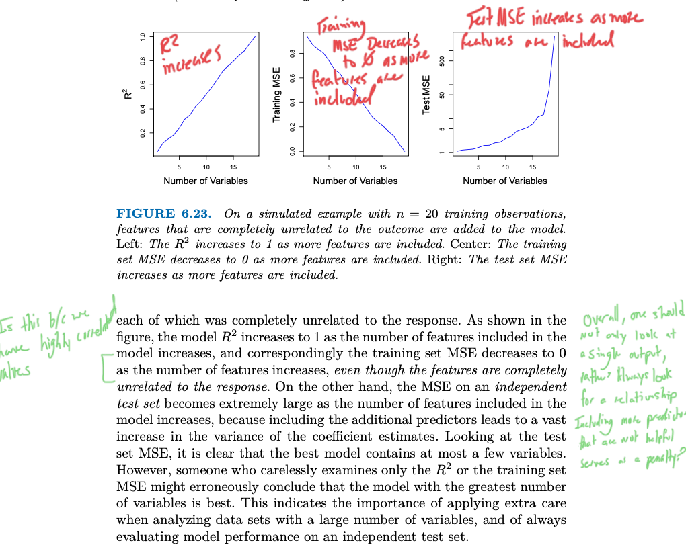

# Task 3: Considerations in High Dimensions
In this QMD, I explore the importance of looking deeper into large datasets that have a large number of variables.

## Reading Section 6.4 - Considerations in High Dimensions 
#### An Introduction to Statistical Learning with applications in Python. The section covers challenges to fitting regression models and interpreting results on high-dimensional data.

- In the section of 6.4.2, what goes wrong in high dimensions?, in Figure 6.23, it explains the importance of applying extra care when analyzing data sets with a large number of variables and always evaluating model performance on an independent test set. It explains that as R2 increases the training MSE decreases to zero as more features are included, but the test MSE increases as more features are included. Is this becuase of overfitting when added to a different dataset and is the test MSE having a penatly for adding additional variables?

### Generative AI Tool Used - Claude
I inserted a screen shot of page 264, then copy and pasted my question from the section above, following this I asked if my interpretation was correct.

### Claude response - 
Your interpretation is correct!Your interpretation is correct! Let me clarify the two parts of your question:
Is it overfitting? Yes exactly — the model memorizes the training data including the noise from irrelevant features, so R² → 1 and training MSE → 0. But those irrelevant features add no real signal, so performance on new data gets worse.
Is test MSE penalizing additional variables? Not exactly a "penalty" — what's actually happening is that each additional irrelevant feature increases the variance of the coefficient estimates. The model has to estimate more parameters with the same amount of data, so the estimates become unstable and unreliable on new data.
Think of it this way — if you have 20 observations and 20 features, you can perfectly fit the training data with many possible coefficient combinations, but none of them will generalize.

### Prompt by assingment-
I am graduate student familiar with foundational graduate-level statistics. I am taking a course in machine learning and have been covering regressions in high dimensions. I am trying to understand the importance of. applying extra care when analyzing data sets with a large number of variables and always evaluating model performance on an independent test set.
Can you break it down in very simple terms and create an analogy for this topic? Make this response very concise, avoid matrix notation

### Claude response-
**The core problem:** When you have many predictors, your model has too much freedom. It will find patterns in the training data — even in pure noise — and treat them as real signal.

**Simple analogy:** Imagine memorizing 20 practice exam questions perfectly. If the real exam has the same 20 questions, you score 100%. But if the professor swaps in new questions testing the same concepts, you fail — because you memorized, not learned.

Adding more irrelevant features is like memorizing more practice questions that won't appear on the real exam. Your "training score" looks great, but you haven't actually learned anything useful.

**Why test MSE explodes:** With many features and few observations, there are countless coefficient combinations that fit the training data perfectly — but they're all unstable. Tiny changes in the data produce wildly different estimates, so predictions on new data fall apart.

**The fix:** Always evaluate on held-out data. Training performance alone is meaningless in high dimensions.

### Reflection
In the first specific question I asked claude, to check if my understanding was correct. I included a screenshot of what I was referring to which avoided me copying and pasting text from the book to more of a direct approach. I felt the response I recieved from claude was good, it did clarify my question if my interpretation was correct. The second part I used the prompt from the assignment, this was a different way to think about and helped clarify my understanding on this section. Overall, the response I recieved did match the response of the textbook. I did a total of 2 iterations using claude.
